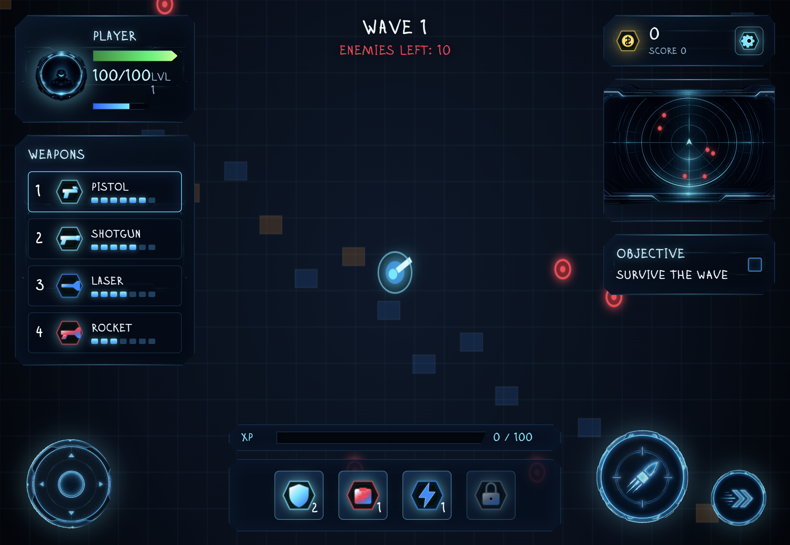

# Neon Breach

A neon sci-fi browser shooter built with plain HTML, CSS, and JavaScript.

## Live Demo

Play here: [https://wuisabel-gif.github.io/Top-Down-Shooter/](https://wuisabel-gif.github.io/Top-Down-Shooter/)

Watch the live play demo: [https://youtu.be/rsETcoiq-Rg](https://youtu.be/rsETcoiq-Rg)

## Development Progression

Neon Breach grew through three visible stages: first a simple playable prototype, then a full sci-fi combat HUD, and finally a role selection flow that makes the game feel more like a complete roguelike shooter.

### Stage 1: Prototype Arena

The first version focused on proving the core loop: move, aim, shoot, survive waves, and track score. The visuals were simple, with basic red and blue combat shapes standing in for enemies, bullets, and the player.



### Stage 2: Version 1.1 Gameplay HUD

The current gameplay screen adds the polished cyberpunk interface: weapon panel, player health, XP bar, radar, objective tracker, score/currency panel, touch controls, generated icons, improved bullets, and clearer enemy/player presentation.


### Stage 3: Pilot Selection

The role selection screen adds a pre-game choice layer, letting players choose different pilots before deploying into the arena.


## Version 1.1 Progress

Version 1.1 focuses on turning the prototype into a more complete roguelike shooter experience.

- Added role/pilot selection with multiple playable character cards
- Improved the sci-fi HUD, weapon panel, score panel, radar, XP bar, and touch controls
- Improved player presentation with generated avatar/portrait assets
- Improved enemy visuals and enemy behavior variety
- Added distinct weapon logic for pistol, shotgun, laser, and rocket launcher
- Added different bullet/projectile styles for each weapon
- Added weapon unlock costs so stronger weapons require currency before use
- Made the first two waves easier for a smoother start
- Added sound effects and background music support

## What Is In The Game

- Pilot selection with 14 playable character cards
- Data-driven weapon system for pistol, shotgun, laser, and rocket launcher
- Wave-based survival loop with score, currency, XP, and level progression
- Enemy archetypes with different behavior: runner, tank, shooter, and exploder
- Enemy projectiles, splash damage, knockback, crits, piercing, and shockwave effects
- Mobile touch controls and portrait-to-landscape guard for phones

## Game Logic

Most gameplay logic lives in `game.js`.

- `WEAPONS` defines weapon balance in one place, including damage, fire rate, projectile speed, spread, projectile count, pierce, knockback, crit chance, crit multiplier, and explosion values.
- `enemyTypes` defines enemy archetypes and their combat behavior.
- The main loop handles movement, spawning, combat, collisions, rewards, HUD updates, and rendering.
- Pilot selection is data-driven, so adding new character cards mostly means adding portrait assets and a new pilot entry.

## Art And UI Notes

- All UI icons were generated with ChatGPT.
- Several HUD, control, and selection assets were generated or assembled with ChatGPT as part of the visual iteration process.
- Enemy and player portrait assets in the repository are integrated directly into the in-game HUD and selection screens.

## Controls

- Move: `WASD` or Arrow Keys
- Aim: Mouse
- Shoot: Left Click or `Space`
- Switch weapons: `1` `2` `3` `4`
- Restart after death: `R`

## Mobile

- The game includes mobile HUD scaling and fixed touch controls.
- On phones, the game blocks portrait mode and asks the player to rotate to landscape.

## Run Locally

Open `index.html` in your browser, or run a simple static server such as:

```bash
python3 -m http.server 4174
```

Then open `http://localhost:4174/`.

## Project Structure

- `index.html` - game layout, HUD, pilot selection, and mobile overlays
- `style.css` - desktop and mobile UI styling
- `game.js` - core gameplay systems, rendering, weapons, enemies, and progression
- `assets/` - UI, portraits, icons, prompts, and gameplay art

## Current Direction

This project is no longer just a prototype arena. The current direction is a more polished roguelike shooter with:

- clearer weapon identities
- stronger enemy behavior variety
- better HUD readability
- more character selection and mobile support
